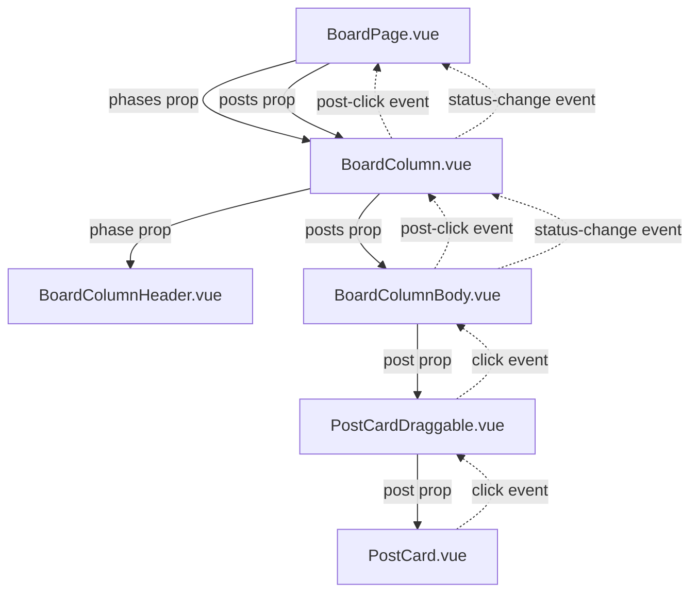
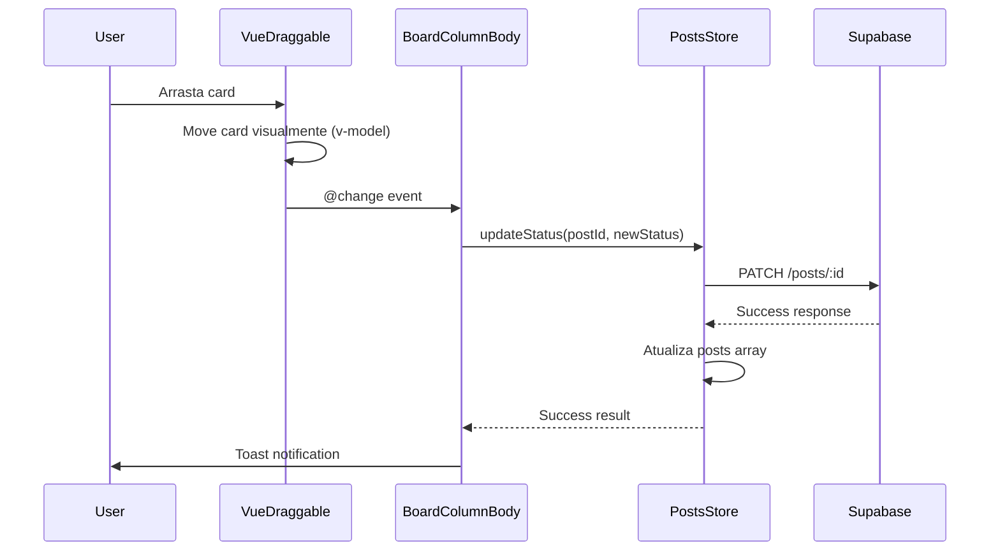

# 🏗️ Arquitetura do Board Componentizado

## 📋 Visão Geral

O Board de Produção foi refatorado em uma arquitetura modular e escalável, seguindo os princípios de componentes Vue 3 com Composition API.

---

## 🧩 Estrutura de Componentes

```
src/
├── components/
│   └── board/
│       ├── BoardColumn.vue           (Container de coluna)
│       ├── BoardColumnHeader.vue     (Header com métricas)
│       ├── BoardColumnBody.vue       (Corpo com drag & drop)
│       ├── BoardEmptyState.vue       (Estado vazio)
│       └── PostCardDraggable.vue     (Wrapper de card)
│
├── pages/
│   └── BoardPage.vue                 (Orquestrador principal)
│
└── css/
    ├── app.scss                      (Imports globais)
    └── board-animations.scss         (Animações CSS)
```

---

## 🔄 Fluxo de Dados

### Arquitetura de Props Down / Events Up



### Fluxo de Drag & Drop



---

## 📦 Responsabilidades dos Componentes

### 1. BoardPage.vue (Orquestrador)

**Responsabilidades:**
- Buscar dados (phases, posts)
- Gerenciar loading states
- Coordenar navegação
- Lidar com eventos de alto nível

**State:**
```javascript
const phases = computed(() => workflowStore.phases)
const postsByStatus = postsStore.postsByStatus
const loading = computed(() => postsStore.loading || workflowStore.loading)
```

**Props passadas:**
- `phase`: Objeto com dados da fase
- `posts`: Array de posts filtrados por status

**Events escutados:**
- `status-change`: Post mudou de coluna
- `post-click`: Usuário clicou em card

---

### 2. BoardColumn.vue (Container)

**Responsabilidades:**
- Unir header + body
- Aplicar estilos dinâmicos baseados em cor da fase
- Propagar eventos

**Props:**
```typescript
{
  phase: {
    key: string,
    title: string,
    icon: string,
    color: string
  },
  posts: Array,
  showProgress: boolean,
  maxCount: number
}
```

**Computed:**
```javascript
const columnStyle = computed(() => {
  // Gera CSS variables dinâmicas
  return {
    '--phase-color': `rgb(...)`,
    '--phase-color-light': `rgba(...)`,
    borderTop: `4px solid ...`
  }
})
```

**Events:**
- Recebe de children e propaga para parent

---

### 3. BoardColumnHeader.vue (Header)

**Responsabilidades:**
- Exibir ícone, título, contagem
- Animar badge ao mudar número
- Progress bar opcional

**Props:**
```typescript
{
  phase: Object,
  count: number,
  showProgress: boolean,
  maxCount: number
}
```

**Watchers:**
```javascript
watch(() => props.count, (newVal, oldVal) => {
  if (newVal !== oldVal) {
    // Trigger pulse animation
    badgePulse.value = true
    setTimeout(() => {
      badgePulse.value = false
    }, 600)
  }
})
```

---

### 4. BoardColumnBody.vue (Core)

**Responsabilidades:**
- Gerenciar VueDraggable
- Sincronizar estado local com props
- Atualizar banco de dados
- Lidar com loading e erros
- Exibir empty state

**Props:**
```typescript
{
  posts: Array,
  phaseKey: string
}
```

**State local:**
```javascript
const localPosts = ref([...props.posts])
const loading = ref(false)
const isDragOver = ref(false)
```

**Sync com props:**
```javascript
watch(() => props.posts, (newPosts) => {
  localPosts.value = [...newPosts]
}, { deep: true })
```

**Handler crítico:**
```javascript
async function handleDragChange(event) {
  if (event.added) {
    const post = event.added.element
    const newStatus = props.phaseKey
    
    loading.value = true
    
    try {
      const result = await postsStore.updateStatus(post.id, newStatus)
      
      if (!result.success) {
        throw new Error(result.error)
      }
      
      $q.notify({ type: 'positive', message: 'Sucesso!' })
      emit('status-change', { postId: post.id, newStatus })
      
    } catch (error) {
      $q.notify({ type: 'negative', message: error.message })
      
      // Reverter: recarregar posts
      await postsStore.fetchPosts()
      
    } finally {
      loading.value = false
    }
  }
}
```

---

### 5. PostCardDraggable.vue (Wrapper)

**Responsabilidades:**
- Adicionar comportamento de drag ao PostCard
- Aplicar estilos de drag (ghost, sombra)
- Filtrar eventos de click vs drag

**Props:**
```typescript
{
  post: Object
}
```

**State:**
```javascript
const isDragging = ref(false)
```

**Click handler:**
```javascript
function handleClick() {
  // Só emitir se não estiver arrastando
  if (!isDragging.value) {
    emit('click')
  }
}
```

---

### 6. BoardEmptyState.vue (Estado Vazio)

**Responsabilidades:**
- Exibir ícone animado
- Mensagem amigável
- Indicar que é drag zone

**Sem props, sem state**

Apenas apresentação visual com animação CSS.

---

## 🎨 Sistema de Estilos

### Variáveis CSS Dinâmicas

Cada coluna tem variáveis CSS geradas dinamicamente:

```scss
.board-column {
  // Gerado pelo BoardColumn.vue
  --phase-color: rgb(33, 150, 243);
  --phase-color-light: rgba(33, 150, 243, 0.05);
  --phase-color-border: rgba(33, 150, 243, 0.2);
  
  // Usado nos componentes filhos
  background: linear-gradient(
    to bottom,
    var(--phase-color-light),
    white 40%
  );
}
```

### Classes do VueDraggable

```scss
// Ghost (placeholder)
.ghost-card {
  opacity: 0.4;
  background: linear-gradient(135deg, #e3f2fd 0%, #bbdefb 100%);
  border: 2px dashed #2196f3;
}

// Card sendo arrastado
.drag-card {
  cursor: grabbing;
  box-shadow: 0 12px 32px rgba(0, 0, 0, 0.3);
  transform: rotate(3deg) scale(1.05);
  z-index: 9999;
}

// Coluna em drag over
.drag-over {
  background: rgba(33, 150, 243, 0.08);
  border: 2px dashed rgba(33, 150, 243, 0.4);
}
```

### Animações

Arquivo `board-animations.scss` contém:

1. **slideIn / slideOut** - Cards entrando/saindo
2. **dragOverPulse** - Coluna pulsando ao receber drag
3. **badgeBounce** - Badge pulando ao mudar número
4. **shake** - Erro em operação
5. **glow** - Highlight de elementos
6. **float** - Empty state animado
7. **skeleton-loading** - Loading states
8. **boardAppear** - Fade in do board inteiro

---

## 🔌 Integração com Stores

### Posts Store

```javascript
// src/stores/posts.js

// State
const posts = ref([])
const loading = ref(false)

// Getters
const postsByStatus = computed(() => {
  // Agrupa posts por status
  const grouped = {
    ideas: [],
    in_production: [],
    // ...
  }
  
  posts.value.forEach((post) => {
    if (grouped[post.status]) {
      grouped[post.status].push(post)
    }
  })
  
  return grouped
})

// Actions
async function updateStatus(id, newStatus) {
  // 1. Update no banco
  await supabase.from('posts').update({ status: newStatus }).eq('id', id)
  
  // 2. Buscar dados completos atualizados
  const { data } = await supabase
    .from('posts')
    .select('*, ...')  // Com relacionamentos
    .eq('id', id)
    .single()
  
  // 3. Atualizar array local
  const index = posts.value.findIndex((p) => p.id === id)
  if (index !== -1) {
    posts.value[index] = data
  }
  
  return { success: true, data }
}
```

### Workflow Store

```javascript
// src/stores/workflow.js

// State
const phases = ref([])

// Actions
async function fetchPhases() {
  const { data } = await supabase
    .from('workflow_phases')
    .select('*')
    .order('order_index', { ascending: true })
  
  phases.value = data
}
```

---

## 🚀 Performance

### Otimizações Implementadas

1. **V-model no VueDraggable**
   - Atualização visual instantânea (otimista)
   - Banco sincroniza em background

2. **Computed Properties**
   - `postsByStatus` só recalcula quando `posts` mudam
   - `phases` é cached

3. **Deep Watch Seletivo**
   - Apenas `localPosts` usa `{ deep: true }`
   - Outros watchers são rasos

4. **Loading States Localizados**
   - Cada coluna tem seu próprio loading
   - Não bloqueia UI inteira

5. **CSS Animations**
   - Usa `transform` e `opacity` (GPU acelerado)
   - `will-change` em elementos de drag

6. **Lazy Imports**
   - Componentes importados sob demanda
   - Chunk splitting automático pelo Vite

---

## 🧪 Testabilidade

### Unit Tests (Recomendados)

```javascript
// BoardColumnHeader.test.js
describe('BoardColumnHeader', () => {
  it('should pulse badge when count changes', async () => {
    const wrapper = mount(BoardColumnHeader, {
      props: { phase, count: 5 }
    })
    
    await wrapper.setProps({ count: 6 })
    
    expect(wrapper.find('.count-badge').classes()).toContain('badge-pulse')
  })
})
```

```javascript
// BoardColumnBody.test.js
describe('BoardColumnBody', () => {
  it('should call updateStatus on drag change', async () => {
    const mockStore = { updateStatus: vi.fn() }
    
    const wrapper = mount(BoardColumnBody, {
      props: { posts: [...], phaseKey: 'ideas' },
      global: { provide: { store: mockStore } }
    })
    
    await wrapper.vm.handleDragChange({
      added: { element: { id: '123' } }
    })
    
    expect(mockStore.updateStatus).toHaveBeenCalledWith('123', 'ideas')
  })
})
```

### E2E Tests (Recomendados)

```javascript
// board.e2e.js
describe('Board Drag & Drop', () => {
  it('should move post between columns', () => {
    cy.visit('/board')
    
    cy.get('[data-test="post-123"]')
      .drag('[data-test="column-in_production"]')
    
    cy.contains('Status atualizado com sucesso')
    
    cy.reload()
    
    cy.get('[data-test="column-in_production"]')
      .should('contain', 'Post Title')
  })
})
```

---

## 📊 Métricas de Código

### Antes da Refatoração

| Métrica | Valor |
|---------|-------|
| Arquivos | 1 (BoardPage.vue) |
| Linhas | 182 |
| Componentes | 1 |
| Funções | 5 |
| Complexidade ciclomática | 8 |
| Duplicação | Média |

### Depois da Refatoração

| Métrica | Valor |
|---------|-------|
| Arquivos | 6 (1 page + 5 components) |
| Linhas totais | ~800 (distribuídas) |
| Componentes | 6 |
| Funções | 15 (bem definidas) |
| Complexidade ciclomática | 3-4 por componente |
| Duplicação | Nenhuma |
| Reusabilidade | Alta |

---

## 🔐 Segurança

### RLS Policies

Todas as operações passam pelo Supabase RLS:

```sql
-- posts table
CREATE POLICY "Users can update posts they created"
ON posts FOR UPDATE
USING (auth.uid() = created_by)
WITH CHECK (auth.uid() = created_by);
```

### Client-side

- Não há SQL direto no frontend
- Todas as queries via Supabase client
- Token JWT renovado automaticamente
- Store valida permissões

---

## 🌐 Responsive Design

### Breakpoints

```scss
// Desktop (> 1024px)
.board-column {
  min-width: 320px;
  max-width: 380px;
}

// Tablet (768px - 1024px)
@media (max-width: 1024px) {
  .board-column {
    min-width: 280px;
    max-width: 320px;
  }
}

// Mobile (< 768px)
@media (max-width: 768px) {
  .board-column {
    min-width: 260px;
    max-width: 300px;
  }
  
  // Scroll horizontal
  .board-container {
    overflow-x: auto;
  }
}
```

### Touch Support

VueDraggable inclui suporte nativo a touch:

```javascript
<draggable
  :force-fallback="true"  // Garante consistência em mobile
  // ...
>
```

---

## 🔄 Estado e Sincronização

### Fluxo de Estado

```
1. User arrasta card
   ↓
2. VueDraggable atualiza localPosts (imediato)
   ↓
3. @change event dispara
   ↓
4. handleDragChange chamado
   ↓
5. updateStatus na store (async)
   ↓
6. PATCH request ao Supabase
   ↓
7. SELECT completo com relacionamentos
   ↓
8. Store atualiza posts array
   ↓
9. Computed postsByStatus recalcula
   ↓
10. BoardPage recebe novo posts prop
    ↓
11. BoardColumn recebe novo posts prop
    ↓
12. BoardColumnBody sincroniza localPosts
```

### Race Conditions

**Problema potencial:** Usuário arrasta múltiplos cards rapidamente

**Solução implementada:**
- Loading overlay durante operação
- Cada coluna tem seu próprio loading state
- VueDraggable permite múltiplos drags simultâneos
- Store queue de updates (implícito pelo JavaScript event loop)

---

## 📚 Referências

- [Vue 3 Composition API](https://vuejs.org/guide/extras/composition-api-faq.html)
- [VueDraggable Docs](https://github.com/SortableJS/vue.draggable.next)
- [Quasar Framework](https://quasar.dev/)
- [Supabase Client](https://supabase.com/docs/reference/javascript/introduction)

---

**Arquitetura:** Modular, Escalável, Testável
**Status:** ✅ Implementada e Documentada
**Última atualização:** 02/02/2026
