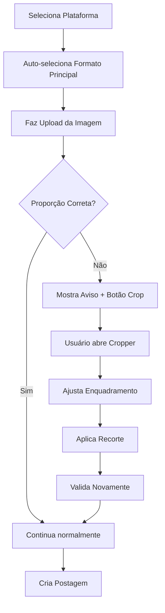

# Implementação de Formatos de Postagem - Resumo

## ✅ O que foi implementado

### 1. Sistema de Formatos por Plataforma

Foram implementados os formatos corretos para cada plataforma conforme especificado:

#### Instagram
- ✅ **9:16** → Reels / Stories (principal)
- ✅ **4:5** → Feed (muito aceito)
- ✅ **1:1** → Feed (aceito)

#### Facebook
- ✅ **1:1** → Feed (principal)
- ✅ **4:5** → Feed (muito aceito)
- ✅ **9:16** → Stories / Reels

#### TikTok
- ✅ **9:16** → Padrão absoluto
- ✅ **1:1** → Aceito

### 2. Componente de Enquadramento (ImageCropper)

Criado componente completo que permite ao usuário enquadrar suas imagens:

**Recursos:**
- Área de recorte com proporção fixa baseada no formato selecionado
- Handles de redimensionamento nos 4 cantos
- Movimentação da área de crop por drag
- Controle de zoom (1x a 3x)
- Grade de composição (regra dos terços)
- Preview em tempo real
- Informações de dimensões original e recorte
- Botões de aplicar, cancelar e redefinir

### 3. Modularização

O código foi completamente modularizado para facilitar manutenção:

```
📁 Arquivos Criados/Modificados:

NOVOS:
├── src/constants/postFormats.js           # Definições de formatos
├── src/composables/usePostFormats.js      # Composable de gerenciamento
├── src/components/ImageCropper.vue        # Componente de crop
└── GUIA-FORMATOS-POSTAGEM.md             # Documentação completa

MODIFICADOS:
├── src/composables/useCreativeValidation.js  # Validação com formatos
└── src/pages/CreatePostPage.vue             # Integração completa
```

## 🎯 Funcionalidades

### Seleção de Formato
- Dropdown automático ao selecionar plataforma
- Formato principal selecionado automaticamente
- Badges coloridos indicando prioridade:
  - 🟢 Verde: Principal
  - 🔵 Azul: Muito aceito
  - 🟠 Laranja: Aceito
  - 🟣 Roxo: Absoluto (TikTok)

### Validação Inteligente
- Validação contextual baseada no formato selecionado
- Avisos visuais se proporção não é ideal
- Sugestão automática de enquadramento
- Revalidação ao trocar formato ou plataforma

### Enquadramento de Imagem
- Botão "Enquadrar" aparece apenas em imagens
- Dialog em tela cheia para melhor experiência
- Mantém proporção exata do formato selecionado
- Processamento automático após aplicar
- Upload da imagem enquadrada

### Dicas Contextuais
- Dicas específicas por plataforma e formato
- Atualização automática ao trocar seleção
- Informações sobre melhor uso de cada formato

## 🔧 Como Usar

### 1. Criar Nova Postagem

1. Selecione a **Rede Social** (Instagram, Facebook ou TikTok)
2. O **Formato** será auto-selecionado para o principal
3. Você pode trocar o formato se desejar
4. Faça upload da imagem
5. Se a proporção não for ideal, clique no botão **Enquadrar** (ícone de crop)
6. Ajuste o enquadramento com drag, resize e zoom
7. Clique em **Aplicar** para confirmar

### 2. Enquadrar Imagem

```
┌─────────────────────────────────────┐
│  Enquadrar Imagem        [9:16]     │
├─────────────────────────────────────┤
│                                     │
│     ┌──────────────┐               │
│     │              │               │
│     │   [IMAGEM]   │  ← Área de   │
│     │              │    recorte   │
│     └──────────────┘               │
│                                     │
│  Original: 1920x1080               │
│  Recorte: 1080x1920                │
│                                     │
│  Zoom: [======•====] 1.5x          │
│                                     │
│  [Cancelar] [Redefinir] [Aplicar]  │
└─────────────────────────────────────┘
```

## 📊 Benefícios

### Para o Usuário
- ✅ Interface intuitiva e visual
- ✅ Feedback imediato sobre formato
- ✅ Controle total sobre enquadramento
- ✅ Não precisa ferramentas externas
- ✅ Garantia de formato correto

### Para Desenvolvedores
- ✅ Código modular e reutilizável
- ✅ Fácil adicionar novas plataformas
- ✅ Composables testáveis
- ✅ Constantes centralizadas
- ✅ Documentação completa

### Para o Negócio
- ✅ Conteúdo sempre no formato correto
- ✅ Melhor performance nas plataformas
- ✅ Redução de erros de publicação
- ✅ Processo mais profissional
- ✅ Conformidade com especificações

## 🎨 Exemplo de Fluxo



## 📈 Próximos Passos Sugeridos

1. **Testes Automatizados**
   - Unit tests para composables
   - Integration tests para ImageCropper
   - E2E tests para fluxo completo

2. **Melhorias de UX**
   - Presets de enquadramento (centralizado, topo, base)
   - Comparação lado a lado (antes/depois)
   - Histórico com undo/redo

3. **Funcionalidades Avançadas**
   - Múltiplos crops para carrossel
   - Ajustes de brilho/contraste
   - Filtros básicos
   - AI para sugestão de enquadramento

4. **Analytics**
   - Tracking de formatos mais usados
   - Taxa de uso do cropper
   - Formatos com melhor performance

## 🐛 Testes Recomendados

### Testes Manuais

- [ ] Selecionar cada plataforma verifica auto-seleção
- [ ] Trocar formato atualiza validações
- [ ] Upload de imagem com proporção correta
- [ ] Upload de imagem com proporção incorreta
- [ ] Abrir cropper e ajustar imagem
- [ ] Aplicar crop e verificar upload
- [ ] Zoom in/out no cropper
- [ ] Drag da área de crop
- [ ] Resize pelos handles
- [ ] Botão redefinir no cropper
- [ ] Cancelar cropper mantém original
- [ ] Criar postagem completa

### Edge Cases

- [ ] Imagem muito pequena
- [ ] Imagem muito grande (>4000px)
- [ ] Proporção já perfeita
- [ ] Trocar formato após crop
- [ ] Múltiplos crops na mesma imagem
- [ ] Cropper sem formato selecionado
- [ ] Imagem portrait em formato landscape

## 📚 Documentação

Consulte o arquivo **GUIA-FORMATOS-POSTAGEM.md** para documentação completa incluindo:
- Estrutura detalhada de arquivos
- API de todos os componentes
- Exemplos de uso
- Troubleshooting
- Boas práticas
- Como estender o sistema

## ✨ Destaques Técnicos

### Canvas API
Uso eficiente da Canvas API para manipulação de imagens sem perda de qualidade.

### Reactive System
Validações e preview atualizados em tempo real com Vue 3 reactivity.

### Modular Architecture
Sistema completamente modular permitindo fácil manutenção e extensão.

### User Experience
Feedback visual imediato e processo intuitivo do início ao fim.

### Code Quality
Código limpo, bem documentado e seguindo best practices do Vue 3.

---

**Implementado com sucesso! 🎉**

Todos os requisitos foram atendidos:
✅ Formatos corretos por plataforma
✅ Enquadramento de imagem pelo usuário
✅ Código modularizado e eficiente
✅ Fácil manutenção
