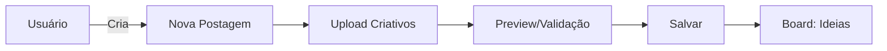
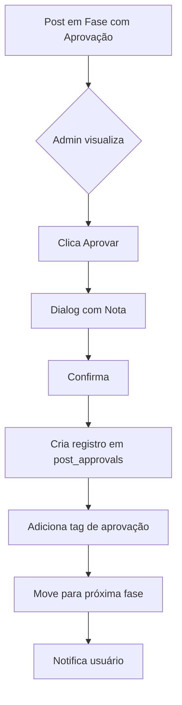
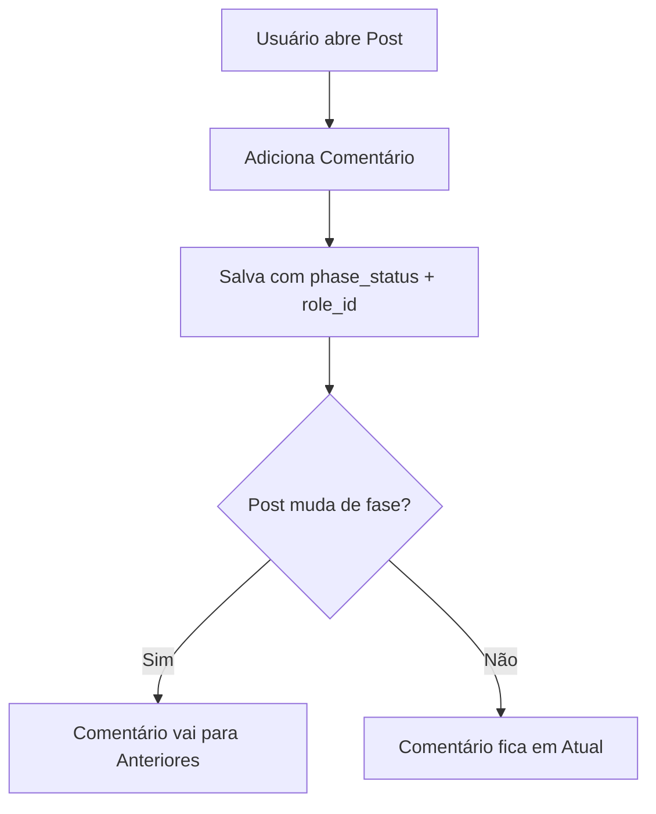
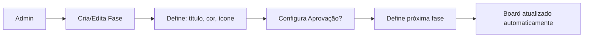

# PMkt - Sistema de Gestão de Conteúdo para Redes Sociais

Sistema desenvolvido em Vue 3 + Quasar Framework para gestão completa de postagens em redes sociais, com workflow configurável, sistema de aprovação e gestão de papéis de usuários.

## 📋 Índice

- [Funcionalidades](#-funcionalidades)
- [Tecnologias](#️-tecnologias)
- [Arquitetura](#-arquitetura)
- [Instalação](#-instalação)
- [Estrutura de Pastas](#-estrutura-de-pastas)
- [Componentes](#-componentes)
- [Composables](#-composables)
- [Stores (Pinia)](#-stores-pinia)
- [Serviços](#-serviços)
- [API/Endpoints](#-apiendpoints-supabase)
- [Banco de Dados](#️-banco-de-dados)
- [Fluxos de Trabalho](#-fluxos-de-trabalho)
- [Guia de Desenvolvimento](#-guia-de-desenvolvimento)

---

## 🎯 Funcionalidades

### Autenticação e Usuários
- Login/Signup com Supabase Auth
- Sistema de perfis (Admin/User)
- **Papéis customizáveis** (Founder, Social Media, Designer, Copywriter, etc.)
- Gestão de usuários com vinculação a papéis
- Guards de rota com proteção por nível de acesso
- Sessão persistente com "Lembrar de mim"

### Workflow Configurável
- **Fases dinâmicas** carregadas do banco de dados
- Cada fase tem: título, cor, ícone, ordem, próxima fase
- **Board Kanban** com colunas geradas automaticamente
- Drag & Drop para mudança de status
- Reordenação de fases via drag & drop (backoffice)
- Configuração de botão de aprovação por fase

### Sistema de Aprovação
- Aprovação apenas por admins
- Banner de aprovação em fases configuradas
- Dialog com nota opcional
- Registro histórico de aprovações (`post_approvals`)
- Tags de aprovação visíveis nos cards
- Movimentação automática para próxima fase

### Comentários por Fase
- Comentários vinculados à fase atual da postagem
- Badge do papel do usuário em cada comentário
- **Organização automática**:
  - Comentários da fase atual: abertos
  - Comentários de fases anteriores: colapsados e riscados
- Histórico completo de todas as fases

### Calendário Editorial
- Visão mensal com navegação
- Mini-cards das postagens por dia
- Cores por status dinâmicas
- Filtros por tipo e rede social

### Dashboard Executivo
- Métricas gerais (Total, Pendentes, Validados, Publicados)
- Posts por rede social
- Posts por status
- Orgânico vs Tráfego Pago
- Resumo semanal
- Acesso rápido às funcionalidades

### Gestão de Postagens
- Formulário completo de criação/edição
- Upload de criativos (imagem, vídeo, carrossel)
- Integração com Supabase Storage
- **Preview nativo** que simula redes sociais
- Validações automáticas (proporção, duração, tamanho, resolução)
- Sistema de tags
- Vinculação com campanhas

### Campanhas
- CRUD completo de campanhas
- Objetivos: Awareness, Consideration, Conversion, Retention, Branding
- Status: Rascunho, Ativa, Pausada, Concluída, Cancelada
- Orçamento e datas
- Vinculação de posts

### Backoffice (Admin)
- **Gestão de Fases**: criar, editar, reordenar, configurar aprovações
- **Gestão de Papéis**: criar papéis com cor e ícone personalizados
- **Gestão de Usuários**: vincular papéis, promover/rebaixar, excluir

---

## 🛠️ Tecnologias

### Frontend
- **Vue 3** (Composition API)
- **Quasar Framework v2** (UI Components)
- **Pinia** (State Management)
- **Vue Router v4** (Routing)
- **date-fns** (Date manipulation)
- **vuedraggable** (Drag & Drop)

### Backend
- **Supabase**
  - Authentication (Auth)
  - PostgreSQL Database
  - Storage (arquivos)
  - Row Level Security (RLS)

### Build Tools
- **Vite** (Build tool)
- **ESLint** (Linting)
- **Prettier** (Code formatting)

---

## 🏗️ Arquitetura

### Padrão de Arquitetura
- **MVVM** (Model-View-ViewModel)
- **Composition API** do Vue 3
- **Store Pattern** com Pinia
- **Service Layer** para lógica de negócio

### Fluxo de Dados
```
User Interaction (View)
    ↓
Component (Template + Script)
    ↓
Store (Pinia) ← → Service Layer
    ↓
Supabase Client
    ↓
Supabase API (Database/Auth/Storage)
```

### Organização por Camadas

**1. Presentation Layer** (Components/Pages)
- Componentes Vue (.vue)
- Focados apenas em UI e interação
- Usam stores para dados

**2. State Management** (Stores)
- Pinia stores
- Estado global da aplicação
- Ações e getters

**3. Business Logic** (Services)
- Lógica de negócio
- Comunicação com API
- Tratamento de erros

**4. Data Layer** (Supabase)
- Banco de dados PostgreSQL
- Autenticação
- Armazenamento de arquivos

---

## 📦 Instalação

### Pré-requisitos
- Node.js (v18+)
- npm ou yarn
- Conta no Supabase

### Passos

1. **Clone o repositório:**
```bash
git clone <repository-url>
cd p-flow
```

2. **Instale as dependências:**
```bash
npm install
```

3. **Configure as variáveis de ambiente:**

Crie o arquivo `.env` na raiz do projeto:
```env
VITE_SUPABASE_URL=https://[seu-projeto].supabase.co
VITE_SUPABASE_ANON_KEY=sua_chave_anonima
```

4. **Execute as migrações SQL:**

Execute os seguintes arquivos SQL no Supabase SQL Editor **NA ORDEM**:
1. `roles-migration.sql` - Cria tabela de papéis
2. `workflow-phases-migration.sql` - Cria tabela de fases
3. `post-comments-phase-migration.sql` - Adiciona campos aos comentários
4. `post-approvals-migration.sql` - Cria tabela de aprovações

5. **Configure o Storage:**
- Crie um bucket chamado `post-creatives` no Supabase Storage
- Marque como público
- Configure as policies (veja `post-approvals-migration.sql`)

6. **Execute o projeto:**
```bash
npm run dev
```

7. **Acesse:**
```
http://localhost:9000
```

---

## 📁 Estrutura de Pastas

```
p-flow/
├── public/                 # Arquivos públicos estáticos
├── src/
│   ├── boot/              # Boot files (inicialização)
│   │   ├── pinia.js       # Inicializa Pinia
│   │   └── supabase.js    # Inicializa cliente Supabase
│   │
│   ├── components/        # Componentes Vue reutilizáveis
│   │   ├── previews/      # Componentes de preview
│   │   │   ├── ImagePreview.vue
│   │   │   ├── VideoPreview.vue
│   │   │   └── CarouselPreview.vue
│   │   ├── CreativeAlerts.vue
│   │   ├── MobilePreview.vue
│   │   ├── PostCard.vue
│   │   ├── PostDetailModal.vue
│   │   ├── PostFilters.vue
│   │   └── PostTagsInput.vue
│   │
│   ├── composables/       # Composables Vue (lógica reutilizável)
│   │   ├── useCreativeValidation.js
│   │   └── useFileUpload.js
│   │
│   ├── css/               # Estilos globais
│   │   ├── app.scss
│   │   └── quasar.variables.scss
│   │
│   ├── layouts/           # Layouts da aplicação
│   │   └── MainLayout.vue
│   │
│   ├── pages/             # Páginas/Views principais
│   │   ├── BoardPage.vue
│   │   ├── CalendarPage.vue
│   │   ├── CampaignsPage.vue
│   │   ├── CreatePostPage.vue
│   │   ├── DashboardPage.vue
│   │   ├── LoginPage.vue
│   │   ├── PhasesPage.vue
│   │   ├── PostDetailPage.vue
│   │   ├── RolesPage.vue
│   │   └── UsersPage.vue
│   │
│   ├── router/            # Configuração de rotas
│   │   ├── auth-guard.js  # Guards de autenticação
│   │   ├── index.js       # Configuração principal
│   │   └── routes.js      # Definição de rotas
│   │
│   ├── services/          # Serviços de API
│   │   └── postsService.js
│   │
│   ├── stores/            # Pinia stores
│   │   ├── auth.js        # Autenticação e usuário
│   │   ├── campaigns.js   # Campanhas
│   │   ├── posts.js       # Postagens
│   │   ├── roles.js       # Papéis de usuários
│   │   └── workflow.js    # Fases do workflow
│   │
│   ├── App.vue            # Componente raiz
│   └── main.js            # Entry point
│
├── .env                   # Variáveis de ambiente (não commitar)
├── .gitignore
├── package.json
├── quasar.config.js       # Configuração do Quasar
├── README.md
├── supabase-schema.sql    # Schema inicial do banco
├── roles-migration.sql    # Migração de papéis
├── workflow-phases-migration.sql
├── post-comments-phase-migration.sql
└── post-approvals-migration.sql
```

---

## 🧩 Componentes

### Componentes Principais

#### `PostCard.vue`
Card resumido de postagem exibido no board e calendário.

**Props:**
- `post` (Object) - Dados da postagem

**Features:**
- Badge de rede social com ícone e cor
- Badge de tipo (Orgânico/Ads)
- Badges de aprovação
- Avatar do responsável
- Info de agendamento

**Uso:**
```vue
<PostCard :post="post" @click="handleClick" />
```

---

#### `PostDetailModal.vue`
Modal completo de detalhes e edição da postagem.

**Props:**
- `modelValue` (Boolean) - Controla visibilidade
- `postId` (String) - ID da postagem

**Features:**
- Formulário de edição completo
- Preview nativo com MobilePreview
- **Comentários organizados por fase** (atual/anteriores)
- **Sistema de aprovação** (banner + dialog)
- Upload de criativos
- Histórico de ações

**Emits:**
- `update:modelValue` - Fecha o modal

**Uso:**
```vue
<PostDetailModal 
  v-model="showModal" 
  :post-id="selectedPostId" 
/>
```

---

#### `MobilePreview.vue`
Frame de smartphone para preview de conteúdo.

**Props:**
- `platform` (String) - Rede social (instagram, tiktok, facebook)

**Slots:**
- `default` - Conteúdo a ser exibido

**Uso:**
```vue
<MobilePreview platform="instagram">
  <ImagePreview :image-url="url" />
</MobilePreview>
```

---

#### `ImagePreview.vue`
Preview de postagem de imagem.

**Props:**
- `imageUrl` (String) - URL da imagem
- `caption` (String) - Legenda
- `platform` (String) - Rede social

**Features:**
- Validação de aspect ratio
- Header simulado da rede social
- Área de legenda

---

#### `VideoPreview.vue`
Preview de postagem de vídeo.

**Props:**
- `videoUrl` (String) - URL do vídeo
- `caption` (String) - Legenda
- `platform` (String) - Rede social

**Features:**
- Player de vídeo
- Controles play/pause
- Validação de duração
- Progress bar

---

#### `CarouselPreview.vue`
Preview de postagem carrossel.

**Props:**
- `items` (Array) - Lista de itens (imagens/vídeos)
- `caption` (String) - Legenda

**Features:**
- Swipe entre itens
- Indicadores de página
- Suporte para mix de imagem/vídeo

---

#### `CreativeAlerts.vue`
Alertas de validação de criativos.

**Props:**
- `validations` (Array) - Lista de validações

**Features:**
- Alertas coloridos por tipo (info, warning, error)
- Ícones específicos
- Dicas de correção

---

#### `PostFilters.vue`
Componente de filtros de postagens.

**Props:**
- `modelValue` (Object) - Filtros ativos

**Emits:**
- `update:modelValue` - Atualiza filtros

**Features:**
- Filtro por status
- Filtro por rede social
- Filtro por tipo (orgânico/ads)
- Busca por texto

---

#### `PostTagsInput.vue`
Input de tags para postagens.

**Props:**
- `modelValue` (Array) - Tags atuais

**Emits:**
- `update:modelValue` - Atualiza tags

**Features:**
- Adicionar/remover tags
- Tags predefinidas
- Tags customizadas

---

### Componentes de Páginas

#### `BoardPage.vue`
Board Kanban com fases dinâmicas.

**Features:**
- Colunas carregadas do `workflow.js` store
- Drag & Drop entre colunas
- Cores e ícones dinâmicos por fase
- Contador de posts por coluna

---

#### `CalendarPage.vue`
Calendário editorial mensal.

**Features:**
- Navegação entre meses
- Mini-cards por dia
- Cores por status
- Filtros

---

#### `DashboardPage.vue`
Dashboard executivo com métricas.

**Features:**
- Cards de métricas gerais
- Gráficos por rede social e status
- Resumo semanal
- Acesso rápido

---

#### `CreatePostPage.vue`
Formulário de criação de postagem.

**Features:**
- Upload de arquivos (drag & drop)
- Preview em tempo real
- Validações automáticas
- Vinculação com campanha
- Agendamento

---

#### `PhasesPage.vue` (Backoffice)
Gestão de fases do workflow.

**Features:**
- CRUD de fases
- Drag & Drop para reordenar
- Configuração de aprovação
- Definição de próxima fase
- Cores e ícones customizáveis

---

#### `RolesPage.vue` (Backoffice)
Gestão de papéis de usuários.

**Features:**
- CRUD de papéis
- Contador de usuários por papel
- Cores e ícones customizáveis
- Validação de exclusão

---

#### `UsersPage.vue` (Backoffice)
Gestão de usuários.

**Features:**
- Lista de usuários
- Editar papel do usuário
- Promover/rebaixar Admin
- Excluir usuário
- Filtros e busca

---

#### `CampaignsPage.vue`
Gestão de campanhas.

**Features:**
- CRUD de campanhas
- Definição de objetivos e orçamento
- Datas de início/fim
- Filtros por status e objetivo

---

## 🔧 Composables

### `useFileUpload.js`

Composable para upload de arquivos no Supabase Storage.

**Exports:**
```javascript
{
  uploadFile,        // (file) => Promise
  uploadMultipleFiles, // (files[]) => Promise
  isImage,           // (file) => Boolean
  isVideo,           // (file) => Boolean
  getFileExtension,  // (filename) => String
  uploadProgress     // Ref<number>
}
```

**Exemplo:**
```javascript
import { useFileUpload } from 'src/composables/useFileUpload'

const { uploadFile, uploadProgress } = useFileUpload()

const result = await uploadFile(file)
if (result.success) {
  console.log('URL:', result.url)
}
```

**Funcionalidades:**
- Upload para bucket `post-creatives`
- Geração de nome único (UUID)
- Progress tracking
- Validação de tipo de arquivo
- Tratamento de erros

---

### `useCreativeValidation.js`

Composable para validação de criativos (imagens/vídeos).

**Exports:**
```javascript
{
  validateImage,     // (file, platform) => Promise<Array>
  validateVideo,     // (file, platform) => Promise<Array>
  validateCarousel,  // (files) => Promise<Array>
  clearValidations,  // () => void
  validations        // Ref<Array>
}
```

**Validações Realizadas:**

**Imagens:**
- Aspect ratio (1:1, 4:5, 9:16)
- Resolução mínima
- Tamanho de arquivo (< 30MB)
- Formato (jpg, png, webp)

**Vídeos:**
- Duração (Instagram: 3-60s, TikTok: 15-60s)
- Tamanho de arquivo (< 100MB)
- Formato (mp4, mov, avi)

**Carrossel:**
- Número de itens (2-10)
- Consistência de tipos

**Exemplo:**
```javascript
import { useCreativeValidation } from 'src/composables/useCreativeValidation'

const { validateImage, validations } = useCreativeValidation()

await validateImage(file, 'instagram')
// validations.value contém array de alertas
```

---

## 🗄️ Stores (Pinia)

### `auth.js`

Store de autenticação e perfil do usuário.

**State:**
```javascript
{
  user: null,      // User object from Supabase Auth
  profile: null,   // User profile from public.users
  loading: false
}
```

**Getters:**
```javascript
{
  isAuthenticated: Boolean,
  isAdmin: Boolean,
  userName: String
}
```

**Actions:**
```javascript
{
  initialize(),           // Carrega sessão
  signIn(email, password, rememberMe),
  signUp(email, password, name),
  signOut(),
  loadProfile(),
  updateProfile(data)
}
```

**Exemplo:**
```javascript
import { useAuthStore } from 'stores/auth'

const authStore = useAuthStore()

await authStore.signIn(email, password, true)
if (authStore.isAdmin) {
  // ...
}
```

---

### `posts.js`

Store de postagens.

**State:**
```javascript
{
  posts: [],
  selectedPost: null,
  loading: false
}
```

**Getters:**
```javascript
{
  postsByStatus: Object,    // Posts agrupados por status
  postsByDate: Object       // Posts agrupados por data
}
```

**Actions:**
```javascript
{
  fetchPosts(),                    // Lista todas
  fetchPostById(id),               // Busca por ID
  createPost(postData),            // Cria nova
  updatePost(id, postData),        // Atualiza
  updateStatus(id, status),        // Muda status
  deletePost(id),                  // Soft delete
  addComment(postId, comment)      // Adiciona comentário
}
```

**Exemplo:**
```javascript
import { usePostsStore } from 'stores/posts'

const postsStore = usePostsStore()

await postsStore.fetchPosts()
const drafts = postsStore.postsByStatus.ideas
```

---

### `workflow.js`

Store de fases do workflow.

**State:**
```javascript
{
  phases: [],
  loading: false
}
```

**Actions:**
```javascript
{
  fetchPhases(),                   // Lista fases
  createPhase(phaseData),          // Cria fase
  updatePhase(id, phaseData),      // Atualiza
  deletePhase(id),                 // Deleta
  approvePost(postId, phaseKey, note), // Aprova post
  getPhaseByKey(key),              // Busca por key
  getPhaseTitleByKey(key)          // Busca título
}
```

**Exemplo:**
```javascript
import { useWorkflowStore } from 'stores/workflow'

const workflowStore = useWorkflowStore()

await workflowStore.fetchPhases()
await workflowStore.approvePost(postId, 'ready_for_review', 'OK!')
```

---

### `roles.js`

Store de papéis de usuários.

**State:**
```javascript
{
  roles: [],
  loading: false
}
```

**Actions:**
```javascript
{
  fetchRoles(),                    // Lista papéis
  createRole(roleData),            // Cria papel
  updateRole(id, roleData),        // Atualiza
  deleteRole(id),                  // Deleta
  getUserCountByRole(roleId)       // Conta usuários
}
```

---

### `campaigns.js`

Store de campanhas.

**State:**
```javascript
{
  campaigns: [],
  loading: false
}
```

**Actions:**
```javascript
{
  fetchCampaigns(),                // Lista campanhas
  createCampaign(campaignData)     // Cria campanha
}
```

---

## 🔌 Serviços

### `postsService.js`

Serviço de comunicação com API de posts.

**Funções:**
```javascript
{
  getPosts(),
  getPostById(id),
  createPost(postData),
  updatePost(id, postData),
  deletePost(id),
  addCreatives(postId, files),
  removeCreative(creativeId),
  addTags(postId, tags),
  removeTags(postId, tagIds),
  addComment(postId, comment)
}
```

**Exemplo:**
```javascript
import { postsService } from 'src/services/postsService'

const posts = await postsService.getPosts()
await postsService.addCreatives(postId, [
  { url: 'https://...', type: 'image/jpeg' }
])
```

---

## 🌐 API/Endpoints (Supabase)

### Autenticação

```javascript
// Supabase Auth
supabase.auth.signInWithPassword({ email, password })
supabase.auth.signUp({ email, password })
supabase.auth.signOut()
supabase.auth.getSession()
```

---

### Posts

**Tabela:** `posts`

```javascript
// Listar posts
supabase
  .from('posts')
  .select('*, created_by_user:created_by(id, name, avatar_url), post_creatives(*), post_tags(*)')
  .is('deleted_at', null)
  .order('scheduled_date', { ascending: true })

// Buscar por ID
supabase
  .from('posts')
  .select('*, post_comments(*, user:user_id(id, name, avatar_url, role_id), role:role_id(*))')
  .eq('id', postId)
  .single()

// Criar post
supabase
  .from('posts')
  .insert({ ...postData })
  .select()

// Atualizar post
supabase
  .from('posts')
  .update({ ...updates })
  .eq('id', postId)

// Soft delete
supabase
  .from('posts')
  .update({ deleted_at: new Date().toISOString() })
  .eq('id', postId)
```

---

### Comentários

**Tabela:** `post_comments`

```javascript
// Adicionar comentário
supabase
  .from('post_comments')
  .insert({
    post_id: postId,
    user_id: userId,
    comment: text,
    phase_status: currentPhase,  // Fase atual da postagem
    role_id: userRoleId          // Papel do usuário
  })
  .select('*, user:user_id(*), role:role_id(*)')
```

---

### Criativos

**Tabela:** `post_creatives`

```javascript
// Adicionar criativos
supabase
  .from('post_creatives')
  .insert([
    {
      post_id: postId,
      file_url: url,
      file_type: type,
      order_index: index
    }
  ])

// Remover criativo
supabase
  .from('post_creatives')
  .delete()
  .eq('id', creativeId)
```

---

### Tags

**Tabela:** `post_tags`

```javascript
// Adicionar tags
supabase
  .from('post_tags')
  .insert([
    {
      post_id: postId,
      tag_type: 'objective',  // ou 'product' ou 'approval'
      tag_value: 'awareness'
    }
  ])
```

---

### Storage

**Bucket:** `post-creatives`

```javascript
// Upload
const { data, error } = await supabase.storage
  .from('post-creatives')
  .upload(`${uuid()}-${fileName}`, file)

// Get public URL
const { data } = supabase.storage
  .from('post-creatives')
  .getPublicUrl(path)

// Delete
await supabase.storage
  .from('post-creatives')
  .remove([path])
```

---

### Workflow Phases

**Tabela:** `workflow_phases`

```javascript
// Listar fases
supabase
  .from('workflow_phases')
  .select('*')
  .order('order_index', { ascending: true })

// Atualizar ordem
supabase
  .from('workflow_phases')
  .update({ order_index: newIndex })
  .eq('id', phaseId)
```

---

### Aprovações

**Tabela:** `post_approvals`

```javascript
// Criar aprovação
supabase
  .from('post_approvals')
  .insert({
    post_id: postId,
    phase_key: phaseKey,
    approved_by: adminId,
    approval_note: note
  })
```

---

### Papéis

**Tabela:** `roles`

```javascript
// Listar papéis
supabase
  .from('roles')
  .select('*')
  .order('name')

// Vincular papel a usuário
supabase
  .from('users')
  .update({ role_id: roleId })
  .eq('id', userId)
```

---

### Campanhas

**Tabela:** `campaigns`

```javascript
// Listar campanhas
supabase
  .from('campaigns')
  .select('*')
  .is('deleted_at', null)
  .order('created_at', { ascending: false })

// Criar campanha
supabase
  .from('campaigns')
  .insert({ ...campaignData, created_by: userId })
```

---

## 🗄️ Banco de Dados

### Tabelas Principais

#### `users`
Perfis de usuários (extensão de `auth.users`).

```sql
- id (UUID, PK, FK auth.users)
- role (TEXT, CHECK: 'admin'|'user')
- role_id (UUID, FK roles)
- name (TEXT)
- avatar_url (TEXT)
- created_at (TIMESTAMP)
- updated_at (TIMESTAMP)
```

---

#### `roles`
Papéis customizáveis de usuários.

```sql
- id (UUID, PK)
- name (TEXT, UNIQUE)
- description (TEXT)
- color (TEXT)
- icon (TEXT)
- created_at (TIMESTAMP)
- updated_at (TIMESTAMP)
```

**Papéis Padrão:**
- Founder/Cliente
- Social Media
- Designer
- Copywriter

---

#### `workflow_phases`
Fases configuráveis do workflow.

```sql
- id (UUID, PK)
- key (TEXT, UNIQUE)
- title (TEXT)
- order_index (INTEGER)
- has_approval_button (BOOLEAN)
- approval_tag_label (TEXT)
- next_phase_key (TEXT, FK workflow_phases.key)
- color (TEXT)
- icon (TEXT)
- created_at (TIMESTAMP)
- updated_at (TIMESTAMP)
```

**Fases Padrão:**
1. ideas (Ideias)
2. in_production (Em Produção)
3. ready_for_review (Pronto para Revisão) ✓ Aprovação
4. adjustments_requested (Ajustes Solicitados)
5. validated (Validado) ✓ Aprovação
6. published (Publicado)

---

#### `posts`
Postagens de conteúdo.

```sql
- id (UUID, PK)
- social_network (TEXT, CHECK)
- post_type (TEXT, CHECK: 'organic'|'paid')
- creative_type (TEXT, CHECK: 'image'|'video'|'carousel')
- scheduled_date (TIMESTAMP)
- caption (TEXT)
- status (TEXT, FK workflow_phases.key)
- campaign_name (TEXT)
- campaign_id (UUID, FK campaigns)
- responsible_user_id (UUID, FK users)
- created_by (UUID, FK users)
- created_at (TIMESTAMP)
- updated_at (TIMESTAMP)
- deleted_at (TIMESTAMP)
```

---

#### `post_creatives`
Arquivos de mídia das postagens.

```sql
- id (UUID, PK)
- post_id (UUID, FK posts)
- file_url (TEXT)
- file_type (TEXT)
- order_index (INTEGER)
- created_at (TIMESTAMP)
```

---

#### `post_comments`
Comentários internos nas postagens.

```sql
- id (UUID, PK)
- post_id (UUID, FK posts)
- user_id (UUID, FK users)
- comment (TEXT)
- phase_status (TEXT)     // Nova: fase em que foi criado
- role_id (UUID, FK roles) // Nova: papel do usuário
- created_at (TIMESTAMP)
```

---

#### `post_tags`
Tags das postagens.

```sql
- id (UUID, PK)
- post_id (UUID, FK posts)
- tag_type (TEXT, CHECK: 'objective'|'product'|'approval')
- tag_value (TEXT)
- created_at (TIMESTAMP)
```

---

#### `post_approvals`
Histórico de aprovações.

```sql
- id (UUID, PK)
- post_id (UUID, FK posts)
- phase_key (TEXT)
- approved_by (UUID, FK users)
- approval_note (TEXT)
- created_at (TIMESTAMP)
```

---

#### `campaigns`
Campanhas de marketing.

```sql
- id (UUID, PK)
- name (TEXT)
- description (TEXT)
- objective (TEXT, CHECK)
- start_date (DATE)
- end_date (DATE)
- budget (DECIMAL)
- status (TEXT, CHECK)
- created_by (UUID, FK users)
- created_at (TIMESTAMP)
- updated_at (TIMESTAMP)
- deleted_at (TIMESTAMP)
```

---

### Row Level Security (RLS)

Todas as tabelas possuem RLS habilitado:

**Usuários autenticados podem:**
- Ver posts não deletados
- Editar posts que criaram ou são responsáveis
- Criar comentários
- Ver comentários

**Admins podem:**
- Tudo que usuários podem
- Gerenciar fases e papéis
- Aprovar postagens
- Excluir usuários

---

## 🔄 Fluxos de Trabalho

### 1. Fluxo de Criação de Postagem



### 2. Fluxo de Aprovação



### 3. Fluxo de Comentários



### 4. Fluxo de Workflow Dinâmico



---

## 👨‍💻 Guia de Desenvolvimento

### Convenções de Código

#### Nomenclatura

**Componentes:**
```javascript
// PascalCase
PostCard.vue
MobilePreview.vue
```

**Composables:**
```javascript
// camelCase com prefixo "use"
useFileUpload.js
useCreativeValidation.js
```

**Stores:**
```javascript
// camelCase sem prefixo
auth.js
posts.js
workflow.js
```

**Funções:**
```javascript
// camelCase, verbos descritivos
async function fetchPosts() {}
function handleClick() {}
```

**Constantes:**
```javascript
// UPPER_SNAKE_CASE
const MAX_FILE_SIZE = 30 * 1024 * 1024
```

---

#### Estrutura de Componentes Vue

```vue
<template>
  <!-- Template clean e semântico -->
</template>

<script setup>
// 1. Imports
import { ref, computed, onMounted } from 'vue'
import { useStore } from 'stores/myStore'

// 2. Props e Emits
const props = defineProps({
  modelValue: Boolean
})
const emit = defineEmits(['update:modelValue'])

// 3. Composables e Stores
const store = useStore()

// 4. State (refs e reactives)
const loading = ref(false)

// 5. Computed
const isActive = computed(() => store.isActive)

// 6. Functions
async function handleSubmit() {
  // ...
}

// 7. Lifecycle
onMounted(() => {
  // ...
})
</script>

<style scoped lang="scss">
// Estilos scoped do componente
</style>
```

---

### Boas Práticas

#### 1. Gestão de Estado
- Use Pinia para estado global
- Use `ref`/`reactive` para estado local
- Evite prop drilling, use stores

#### 2. Composables
- Extraia lógica reutilizável
- Retorne refs e funções
- Use prefixo `use`

#### 3. Tratamento de Erros
```javascript
try {
  const result = await store.fetchData()
  if (result.success) {
    // sucesso
  } else {
    throw new Error(result.error)
  }
} catch (error) {
  $q.notify({
    type: 'negative',
    message: error.message,
    position: 'top'
  })
}
```

#### 4. Loading States
```javascript
const loading = ref(false)

async function fetchData() {
  loading.value = true
  try {
    // ...
  } finally {
    loading.value = false
  }
}
```

#### 5. Componentes Assíncronos
```javascript
// Lazy loading de páginas
{
  path: '/dashboard',
  component: () => import('pages/DashboardPage.vue')
}
```

---

### Adicionando Novas Features

#### 1. Nova Página

```bash
# 1. Criar arquivo de página
src/pages/MinhaPage.vue

# 2. Adicionar rota
src/router/routes.js

# 3. Adicionar ao menu (se necessário)
src/layouts/MainLayout.vue
```

#### 2. Novo Componente

```bash
# Criar componente
src/components/MeuComponente.vue

# Usar em outras páginas
import MeuComponente from 'components/MeuComponente.vue'
```

#### 3. Nova Store

```bash
# 1. Criar store
src/stores/minha-store.js

# 2. Usar no componente
import { useMinhaStore } from 'stores/minha-store'
```

#### 4. Novo Composable

```bash
# 1. Criar composable
src/composables/useMeuComposable.js

# 2. Exportar funções
export function useMeuComposable() {
  return { ... }
}
```

---

### Debug

#### Vue Devtools
Instale a extensão Vue Devtools para:
- Inspecionar componentes
- Ver estado das stores
- Monitorar eventos

#### Supabase Logs
Acesse o dashboard do Supabase:
- Logs de autenticação
- Queries executadas
- Erros de RLS

#### Console do Navegador
```javascript
// Log de desenvolvimento
console.log('Debug:', data)

// Warnings
console.warn('Aviso:', message)

// Erros
console.error('Erro:', error)
```

---

## 🚀 Build para Produção

```bash
# Build
npm run build

# Preview do build
npm run preview
```

Os arquivos serão gerados em `dist/spa/`.

---

## 🔧 Scripts Disponíveis

```bash
# Desenvolvimento
npm run dev

# Build produção
npm run build

# Lint
npm run lint

# Format
npm run format
```

---

## 📚 Recursos Adicionais

### Documentação Oficial
- [Vue 3](https://vuejs.org/)
- [Quasar Framework](https://quasar.dev/)
- [Pinia](https://pinia.vuejs.org/)
- [Supabase](https://supabase.com/docs)

### Arquivos de Referência
- `FINAL_INSTRUCTIONS.md` - Instruções de setup completo
- `supabase-schema.sql` - Schema inicial
- `*-migration.sql` - Migrações incrementais

---

## 🐛 Troubleshooting

### Erro de CORS
- Verifique se `VITE_SUPABASE_URL` está correto (API URL, não dashboard URL)
- Formato: `https://[projeto].supabase.co`

### Erro "Table does not exist"
- Execute todas as migrações SQL na ordem
- Verifique no Supabase se as tabelas foram criadas

### Fases não aparecem
- Execute `workflow-phases-migration.sql`
- Limpe o cache do navegador

### Upload falha
- Verifique se o bucket `post-creatives` existe
- Verifique se as policies estão configuradas
- Limite de 100MB por arquivo

---

## 📄 Licença

Este projeto é privado e proprietário.

---

## 👥 Contribuindo

### Para novos desenvolvedores:

1. Leia esta documentação completa
2. Configure o ambiente local
3. Execute as migrações
4. Explore o código começando por:
   - `src/pages/` - Entenda as páginas
   - `src/stores/` - Veja o fluxo de dados
   - `src/components/` - Conheça os componentes

5. Siga as convenções de código
6. Teste suas mudanças localmente
7. Crie commits descritivos

---

**Desenvolvido para gestão interna de conteúdo de redes sociais** 🚀
